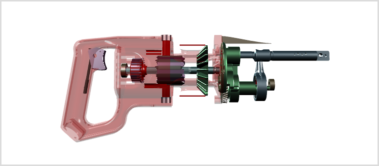

# xeometry

A lightweight open-source WebGL-based IFC model viewing API built on [xeogl](http://xeogl.org).
 
An **xeometry** viewer is a single facade class that wraps xeogl, with methods to
load models from  [glTF](https://github.com/KhronosGroup/glTF),
query, animate and navigate their objects and create sharable custom views.

When the glTF models are tagged with
[IFC](https://en.wikipedia.org/wiki/Industry_Foundation_Classes) element types (optional), then
the viewer can manage the objects using those type codes.

You can also just operate on objects using their IDs:<br><br>
[](http://xeogl.org/examples/#presentation_annotations_tronTank)

```` JavaScript
var viewer = new xeometry.Viewer({ canvasId: "theCanvas" });

viewer.loadModel("saw", "models/Reciprocating_Saw.gltf", function () {
     viewer.setOpacity([ // Make the red plastic casing transparent
         "saw#body-node.entity.0",
         "saw#body-node_1.entity.0",
         "saw#body-node_2.entity.0",
         "saw#body-node_3.entity.0",
         "saw#body-node_11.entity.0",
         "saw#body-node_110.entity.0",
         "saw#body-node_29.entity.0",
         "saw#body-node_7.entity.0",
         "saw#body-node_6.entity.0"
     ], 0.3);
     viewer.viewFit(["saw"]);
});
````

# Contents

- [Examples](#examples)
- [Features](#features)
- [Usage](#usage)
    + [Loading the libs](#loading-the-libs)
    + [Creating and destroying viewers](#creating-and-destroying-viewers)
    + [Loading and unloading models](#loading-and-unloading-models)
      - [Tagging models with IFC types](#tagging-models-with-ifc-types)
    + [Querying models and objects](#querying-models-and-objects)
    + [Querying boundaries of models and objects](#querying-boundaries-of-models-and-objects)
    + [Transforming models and objects](#transforming-models-and-objects)
    + [Showing and hiding models and objects](#showing-and-hiding-models-and-objects)
    + [Controlling the camera](#controlling-the-camera)
    + [Picking and ray casting objects](#picking-and-ray-casting-objects)
    + [Saving and loading bookmarks](#saving-and-loading-bookmarks)

# Examples

* See the [examples gallery](examples/index.html).

# Features

* Load multiple glTF models
* Tag glTF models with IFC types, to access the objects by type
* Create multiple viewers in a page
* Show and hide objects
* Scale, rotate and translate objects
* Query object boundaries
* Find objects in boundary
* Object surface picking and ray casting
* Navigate camera to objects
* Zoom, pan, rotate, spin, fly and jump camera
* Save and load bookmarks

# Usage

### Loading the libs

The first step is to link to the xeogl and xeometry libraries:
````html
<script src="xeogl.js"></script>
<script src="xeometry.js"></script>
````
xeometry's only dependency is the xeogl library.

### Creating and destroying viewers

Create a viewer with a default internally-created canvas that fills the page:
````javascript
var viewer = new xeometry.Viewer();
````

Create a viewer with an existing canvas:
````javascript
var viewer = new xeometry.Viewer({
    canvasId: "myCanvas"
});
````

You can create multiple viewers in the same page.

Destroy a viewer:
````javascript
viewer.destroy();
````

### Loading and unloading models

You can load multiple glTF models into a viewer at the same time. You can also load multiple copies of the same model.

Load two glTF models into a viewer:
````javascript
viewer.loadModel("gearbox", "./GearboxAssy.gltf", function () {

    viewer.loadModel("saw", "./Reciprocating_Saw.gltf", function () {
        //... two models loaded
    });
});
````

Unload a model:
````javascript
viewer.unloadModel("gearbox");
````

#### Tagging models with IFC types

Any entity within a glTF file can have an ````extra```` property for any app-specific information. For xeometry, we
we use that that to tag our objects with IFC types, for example:

````json
{
    //...
    "nodes": [
        {
            "extra": "customData"
        }
    ]
}
````

TODO

### Querying models and objects

You can query the IDs of whatever models and objects are currently loaded.

Get IDs of all models:
````javascript
var models = viewer.getModels();
````

Get IDs of all objects:
````javascript
var objects = viewer.getObjects();
````

Get ID of an object's model:
````javascript
var modelId = viewer.getModel("foo");
````

Get IDs of all objects within a model:
````javascript
var sawObjects = viewer.getObjects("saw");
````

Get IDs of objects of the given IFC type:
````javascript
var typeObjects = viewer.getObjects("ifcCurtainWall");
````

Get object's IFC type:
````javascript
var type = viewer.getType("foo"); // "DEFAULT" by default
````

Get all IFC types currently loaded:
````javascript
var types = viewer.getTypes();
````

### Querying boundaries of models and objects

Everything within a viewer can be queried for its axis-aligned World-space boundary (AABB), which is given as an array containing values ````[xmin, ymin, zmin, xmax, ymax, zmax]````.

Get the collective boundary of everything in a viewer:
````javascript
var allBoundary = viewer.getAABB();
````

Get the boundary of a model:
````javascript
var sawBoundary = viewer.getAABB("saw");
````

Get collective boundary of two objects:
````javascript
var objectsBoundary = viewer.getAABB(["foo", "bar"]);
````

Get collective boundary of all objects of the given IFC types:
````javascript
var objectsBoundary = viewer.getAABB(["IfcFlowController", "IfcFlowFitting"]);
````

Get collective boundary of two models:
````javascript
var modelsBoundary = viewer.getAABB(["saw", "gearbox"]);
````

Get collective boundary of the first five objects within a given model:
````javascript
var objectsBoundary2 = viewer.getAABB(viewer.objects("saw").slice(0, 5));
````

Get collective boundary of a model and a couple of objects:
````javascript
var objectsBoundary3 = viewer.getAABB(["saw", "outerCasing", "trigger");
````

### Transforming models and objects

Each model and object can be independently transformed within a viewer.  Transforming a model or object
will dynamically change the boundary extents returned by ````getAABB()```` (see previous section). A transformation consists of the following operations, applied in this order:

 * scale
 * X-axis rotation (degrees),
 * Y-axis rotation,
 * Z-axis rotation
 * translation

Transform a model, move it along the X axis, scale it, then rotate it 90 degrees about its X-axis:
````javascript
viewer.setTranslate("saw", [100,0,0]);
viewer.setScale("saw", [0.5,0.5,0.5]);
viewer.setRotate("saw", [90,0,0]);
`````

Spin an object about its Y-axis:
````javascript
var angles =[0,0,0]; // Tait-Bryant angles about X, Y and Z, in degrees
function spin() {
    viewer.setRotate("outerCasing", angles);
    angles[1] += 0.1;
    requestAnimationFrame(spin);
}
spin();
`````

Get an object's translation, scale and rotation:
````javascript
var translate = viewer.setTranslate("saw");
var scale = viewer.setScale("saw");
var rotate = viewer.setRotate("saw");
`````

### Showing and hiding models and objects

Show everything in a viewer:
````javascript
viewer.show();
`````

Hide everything in a viewer:
````javascript
viewer.hide();
````

Show all objects within a model:
````javascript
viewer.show("saw");
````

Hide all objects within a model:
````javascript
viewer.hide("saw");
````

Show given objects:
````javascript
viewer.show(["outerCover", "trigger"]);
````

Show all objects of the given IFC types:
````javascript
viewer.show(["IfcFlowController", "IfcFlowFitting"]);
````

Show a model and two objects:
````javascript
viewer.show(["saw", "outerCover", "trigger"]);
````

Hide a model, two objects and all objects of the given IFC type:
````javascript
viewer.hide(["saw", "outerCover", "trigger", "IfcFlowFitting"]);
````

### Controlling the camera

The camera position can be updated at any time. The camera can also be made to fit the view to given models and
objects, either by flying or jumping to a new position.

Get camera eye, look and up:
````javascript
var eye = viewer.getEye();
var look = viewer.getLook();
var up = viewer.getUp();
````

Set camera eye, look and up:
````javascript
viewer.setEye([0,0,-100]);
viewer.setLook([0,0,0]);
viewer.setUp([0,1,0]);
````

Set the duration of camera flight to each new position:
````javascript
viewer.setFlightDuration(2); // Seconds
var duration = viewer.getFlightDuration();
````

When the duration is set to zero, the camera will snap straight to each new position, otherwise it will fly.

Fly camera to given position:
````javascript
// Eye, look and "up" vector
viewer.setEyeLookUp([0,0,-100],[0,0,0],[0,1,0], function() { 
    // Camera arrived
});
````

Fly camera to fit everything in view:
````javascript
viewer.viewFit(function() {
    // Camera arrived
});
````

Fly camera to fit a model in view:
````javascript
viewer.viewFit("saw", function() {
    // Camera arrived
});
````

Fly camera to fit two models in view:
````javascript
viewer.viewFit(["saw", "gearbox"], function() {
    // Camera arrived
});
````

Fly camera to fit all objects of the given IFC types:
````javascript
viewer.viewFit(["IfcFlowController", "IfcFlowFitting"], function() {
    // Camera arrived
});
````

Fly camera to fit a model, two objects, and all objects of the given IFC type:
````javascript
viewer.viewFit(["saw", "outerCover", "trigger", "IfcFlowFitting"], function() {
    // Camera arrived
});
````

Switch camera to "jump" mode, where it will jump directly to each new position:
````javascript
viewer.viewFit(false);
````

Jump camera to given position:
````javascript
// Eye, look and "up" vector
viewer.setEyeLookUp([-100,0,0],[0,0,0],[0,1,0]);
````

Jump camera to fit two objects in view - note we don't need the callback anymore because camera is now jumping:
````javascript
viewer.viewFit(["foo", "bar"]);
````

Jump camera to fit a model and two objects in view:
````javascript
viewer.viewFit(["saw", "outerCasing", "trigger"]);
````

Set how much of the field of view that a target boundary will occupy when flying the camera to fit models or objects to the view:
````javascript
viewer.setViewFitFOV(20); // Degrees
var fitFOV = viewer.fitFOV();
````

### Picking and ray casting objects

You can pick and raycast objects through the API.

Finding the object at the given canvas coordinates:
````javascript
var hit = viewer.pickObject([234, 567]);
if (hit) {
    console.log("object picked: " + hit.id);
}
````

Finding the object at the given canvas coordinates, plus the 3D surface intersection:
````javascript
hit = viewer.pickSurface([234, 567]);
if (hit) {
    var worldPos = hit.worldPos;
    console.log("object picked: " + hit.id);
    console.log("surface coordinates: " + worldPos[0] + "," + worldPos[1] + "," + worldPos[2]);
}
````

Finding the object that intersects a ray:
````javascript
hit = viewer.rayCastObject([0,0,-100], [0,0,1]);
if (hit) {
    console.log("object raycasted: " + hit.id + ");
}
````

Finding the object that intersects a ray, plus the surface intersection:
````javascript
hit = viewer.rayCastSurface([0,0,-100], [0,0,1]);
if (hit) {
    var worldPos = hit.worldPos;
    console.log("object raycasted: " + hit.id);
    console.log("surface coordinates: " + worldPos[0] + "," + worldPos[1] + "," + worldPos[2]);
}
````

### Saving and loading bookmarks

You can save and restore the state of a viewer as a JSON bookmark. The bookmark will include:

 * models loaded,
 * model and object visibilities
 * model and object transforms
 * camera position

Save model state to JSON bookmark, clear model then restore it again from the bookmark:
````javascript
var json = viewer.getBookmark();
viewer.reset();
viewer.setBookmark(json, function() { });
````
